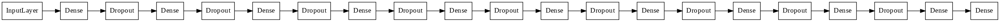

# Predicting Student Success Using Virtual Learning Environment Interaction Statistics

Image by Goran Ivos, courtesy of [Unsplash](https://unsplash.com/)

# Introduction:

## The Problem
Online learning has been a growing and maturing industry for years now, and in a way, the internet has always been about learning.  [Khan Academy](https://www.khanacademy.org/) was, to me, a quintessential step in self-driven learning and massive open online courses (MOOCs) like [Coursera](https://www.coursera.org/) create an even more structured approaches to online, self-driven learning.  I took my first online course on coding fundamentals from [edX](https://www.edx.org/) in 2013 and started my data science journey in 2019 on Coursera.

While these are an amazing resources, they also have high dropout and failure rates.  Many students, accustomed to the accountability features in traditional face-to-face learning, struggle with the openness of these systems and the lack accountability.  In self-driven learning, it can be easy to get lost or give up.

## The Solution

I set out to find ways to use data to help students succeed by identifying those who are in danger of failing or withdrawing early.  Many students in need of special intervention to improve their chances of success can be identified by the way they interact with the online learning system itself.  

The goal of this project is to model student interactions with an online learning environment to predict whether they will ultimately pass or fail a course early enouth for intervention to be effective.  My model captures the underlying patterns of behavior that predict the success of students in any self-paced online learning environment.

In order to simulate this kind of prediction, I fit a model on chronologically earlier cohorts of students, their behavior and outcomes, and then validate my model on the latest cohorts present in the dataset.

## Directory:

[Report Notebook](report/report_notebook.ipynb)

[Exploratory Data Analysis](notebooks/OU_eda.ipynb)

[Shallow Model Development](notebooks/shallow_modeling.ipynb)

[Deep Model Development](notebooks/deep_models.ipynb)

[Data](content/anonymisedData.zip)

[Collection of Model Candidates](models/)

[Various Assorted Charts](figures/)

[Working Environment](predictor_env.yml)

[Presentation](report/OU_student_predictor_presentation.pdf)

# The Data
I used a dataset from [Open University](http://www.openuniversity.edu/) based out of Great Britain.  They are an entirely online university offering accredited degrees to distance learners.  They released anonymized data from seven courses, three from the social sciences and four STEM courses, from the academic years 2012/2013 and 2013/2014.  These courses are repeated twice per year and each repetition is call a 'presentation'. Not all presentations of each course are included in the dataset.  To learn more about how the data was selected and anonymised, please visit this [US National Institute of Health](https://www.ncbi.nlm.nih.gov/pmc/articles/PMC5704676/) site that holds the data for scientific inquiry.

The data is contained in [this zip file](content/anonymisedData.zip) and can be extracted and concatenated with `data = load_OU_data()` function in the src.functions module.  You can use the argument `prediction_window=` to specifiy either a number of days as an integer or a proportion of the data as a float to adjust when in the courses you want to end the prediction window and have the model provide it's predictions.  If run from the '/report' or '/notebooks' folder that function will do all the loading and merging for you.

This dataset contains regional, demographic, and personal data about students, but I was only interested in data about how they interacted with the learning environment.  In the studentVle.csv file available in the [anonymiseData.zip](content/anonymisedData.zip) file the university provided information about each activity that each student interacted with, including the date relative to course start and number of clicks on that activity.  

# Features for Predictive Modeling

I did not use most of the data in the dataset as it was very specific to those students and the region.  My goal is the capture the relationship between student behavior and success, not their background, gender, disability, or socioeconomic situation.  These were also not highly correlative to student success when I explored them.

Instead I used 6 features that a virtual learning environment would be able to collect anonymously:

**Features:**

*Activity Statistics*

1. Number of total clicks during course.
2. Number of total activities completed
3. Number of days worked

It was the last statistic that I felt would be uniquely predictive.  I spent 14 years teaching students and one thing I learned from research and experience is that spreading learning out over more days, rather than cramming more learning on fewer days, helps with persistence and with learning retention.  It helps with persistence because it causes the student to form a habit of learning and we are creatures of habit.  Cramming a lot of learning into fewer days is also more exhausting and less pleasant, creating a sense of aversion to the act.  Frequent reinforcement of learning also serves to reinforce neuronal axons that are the physical manifestation of learning, which makes learning last longer.  I'll show what I found on this later on in this notebook.

The next statistics I pulled to use to train my model were on assessments.

*Assessment Statistics*

1. Average assessment score
2. percentage of assessments completed.

The first was an obvious choice, and the second is meaningful because these courses were in part self-paced.  I found that doing more assessments earlier was correlated to greater success, as you will see in the data exploration section later.

## Correlations in the Data

*Repeat Students*
After preparation I had data on 22,424 individual students who registered for classes 24,743 times.  The data from the Open University dataset was organized into registrations so that is how I organized my data.  I recognize that those 2,319 registrations that represent multiple registrations by the same student violates the independence of observations, and would invalidate inferential modeling.  When I do that kind of analysis I will remove the duplicates.

*Courses (code_module)*

Unfortunately, I had bigger problems.  The data is divided into 7 different courses with different numbers of activities, students, success rates, and average assessment scores.  I want my model to be generalizable to many online courses outside of this dataset and to capture underlying relationships between student behavior and their success in a course.

You can see above that there are significantly different distributions of assessment scores for different courses.

Similarly, you can see that students engaged different numbers of activities depending on the course.

Finally we see a worryingly high difference in completion rates between the courses.

These correlations would make my model accuracy vary by course, my model's ability to predict success specific to these courses, rather than applying broadly.

In order to correct this problem, I took two steps:

1. I scaled the features of each course separately.  Activities completed, assessment scores, etc. are now all relative to the mean for the individual courses.
2. I used [Imbalanced Learn's SMOTE](https://imbalanced-learn.org/stable/generated/imblearn.over_sampling.SMOTE.html) to create synthetic data for the minority class in each course to balance the success rates.  This method creates data which is statistically similar to the data in that class using a K-Nearest Neighbors approach.

The data features and targets were then no longer correlated to the courses.  My model could focus on the behavior itself, relative to how other students are performing in the same course.

The downside is that I cannot use presentations in the test set, the 2014J presentations, for testing if they are the only presentation available.  My preprocessing needs previous examples of a course in order to properly scale the features.  In other words I can't do predictions on courses that are being taught for the first time, or that I don't have historical data for.

The above chart shows correlations between each variable my model uses for predictions, as well as course (`code_module`) and final_result.  If you look along the row for `code_module` you will see that, for the most part, the correlations between courses and features have been removed, and the correlation between courses and `final_result` has been completely removed.

If you look down the final result row you can also see how strongly each of the aggregate features I extracted are to the final result.
1. Days Studied: .35
2. Activities Engaged: .31
3. Total Clicks: .27
4. Assessments Completed: .36
5. Average Assessment Score: .46

I was very excited to see `days_studied` with such a high correlation.  My hypothesis from the start was that spreading learning out over more days would improve persistence and learning and I see validation here.  

You can also see that each of these statistics are also highly correlated to each other, especially `days_studied`, `activities_engaged`, and `total_clicks`.  These variables all represent how much work a student puts in and it's very reasonable that they would correlate.  The count and average score of assessments are also correlated, but less strongly, which is interesting to me. The number of assessments completed varies by student because students can work ahead.

These correlations between predictor variables are a problem if I try to do inferential statistics on these features.  I would not be able to untangle which variables are actually affecting the results and how, since one changes the other.  If I wanted to dig deeper into inference I would have to choose just one of these features to explore and maybe bring back the demographic features that I dropped.

# Data Preparation
I've discussed some of the preparation I did, but here is a more comprehensive description: 

1. I limited the data to what makes sense for the prediction window, or the points in the course I want to make my predictions on.  I won't try to predict the outcomes of students who have already withdrawn, and I a won't use any data that I would not yet have by that point in the course.

2. My data target classes are 'Distinction', 'Pass', 'Fail', and 'Withdrawn'.  However, my predictor only predicts whether a student needs intervention or not.  Those passing or passing with distinction do not need interventions, while those failing or withdrawing do.  I will combine the first two into a new class 'No Intervention' and the second two into 'Needs Intervention'.  This makes my target binary, easier to predict and easier to evaluate.

3. I split the data into training data and testing data to validate my models and identify and prevent overfitting.  Specifically I held all of the chronologically latest presentations, 2014J as a final test set and then used each presentation in befor that, in turn, as validation sets in my cross validation function.  My model was always being tested on a presentation of a course that it was not trained on.  I did this because that is the purpose of my model, to make predictions on a current cohort of students.  I want a model that can accurately predict for groups it has not yet seen.  If I were to randomly choose students across cohorts, or presentations, and then test on different students from the same cohorts it trained on, the model would suffer data leakage from variations between presentations.

4. I scaled all the data course by course.  The CourseScaler class will fit on each individual course in the training set of observations, as indexed by the 'code_module' variable.  It will take the mean and standard deviation for each feature for each course from the training data and use these means and standard deviations to scale ((feature-mean)/standard deviation) features for both the training and the testing data.  This will remove the as much correlation between `code_module` and the activity and assessment statistics as possible.

5. I used the smotecourses() function to apply [imblearn.over_sampling.SMOTE](https://imbalanced-learn.org/stable/generated/imblearn.over_sampling.SMOTE.html) to the training data and create synthetic data within the minority class to balance the classes.  Each course in the training set has equal number of students needing intervention and not needing interventions in the training data.  This will remove the correlation between `code_module` and `final_result` as much as possible.  

6. Once those are done, I drop the `code_module` column because I don't want my model considering that in its predictions.

# Model Development

### Custom Tools

The preprocessing needs for this project are unique and don't work well with off the shelf Sci-Kit Learn and Imbalanceed Learn pipelines, cross-validation, and grid search tools.  My preprocessing steps need the `code_module` feature in order to scale and balance each course separately, but that feature should not be passed to the model.  I also wanted to cross-validate by presentation rather than by randomly assembled folds.  Because of this I had to code my own versions of each of these that would fit a scaler to each course in the training set, use that fit scaler to scale both the training and test set, and then use the Imbalanced Learn SMOTE over-sampler to balance the classes in only the training set.  I also needed custom gridsearch and cross-validation tools to properly apply the proprocessing to prevent data leakage and to cross-validate by presentation rather than by randomly sampled observations.  Once I had these coded, my model development could proceed.

# Under Construction Below This Point

### Logistic Regression

I used a logistic regression model for a baseline model.  A logistic regresson model seeks the best fit line to model the linear relationship between the predictor variables, X, and the target variable, y, which is a linear regression. It then applies a sigmoid function to that line to assign probabilities that each observation belongs in one class or the other.  For my purposes, if the probability of an observation belonging a class is greater than .5, then I will predict that it belongs to that class.  A true baseline would be a randomly guessing model with an accuracy equal to the rate of class imbalance, or, in this case, about 34%.  My hyperparameter-tuned logistic regression model was able to achieve a 74% accuracy on the 2014J presentations and 79% average cross-validation scores.  There is some amount of variance in its performance on each fold, from 69% to 83%, and was 70% accurate on one presentation of module GGG and 80% accurate on another.  This indicates to me that some cohorts are harder to predict that others.  The lower accuracy on the hold-out dataset may indicate that it was generally a harder year for prediction.  In my final model I will explore accuracy across modules within the holdout set, and I find a similar amount of variation across modules, with no apparent pattern between social science and STEM modules

This and most of my shallow models tend to overpredict that students will pass the course, with lower accuracy on students who will not.

### K-Nearest Neighbors

A KNN model uses a tuneable distance metric to determine the distance between observations in n-dimensional space, where n is the number of independent variable features in the training set.  The new observation is classified according to the classes of the K (a tuneable hyper-parameter) nearest training observations.  This classification technique hypothesizes that observations of the same class will cluster together in the n-dimensional space.

My KNN model, after hyperparameter tuning, achieved almost identical results as the logistic regression model.  One benefit of both models, however, is that they train and predict quite quickly.  KNN is a great model to use when you have a low number of features because when classes do cluster together, they do so more tightly in lower dimensional space.

### Decision Tree

The logistic regression model was pretty successful, being twice as accurate as random guessing, but I thought perhaps the problem was not as linear as that model likes.  A decision tree is a promising candidate for a less linear relationship between independent and dependent variables because it does not assume the independence of the features or linear relationship between features and target. Instead it seeks to find the best way to divide and subdivide the data in a tree structure based on the values of different variables.  Once the tree is built, predictions are made by sending an observations down the tree on a path to the predicted class as it reaches each split in the tree is sent in one or the other direction.  You can think of it like a deterministic Pachinko machine.

This model averaged 77% on cross-validation scores, and 73% on the validation set.  Apparently linearity of relationships between the variables is not the only hurdle to overcome in modeling student success.

### Random Forest

This is an interesting extension to the decision tree model.  It creates a whole forest of decision trees and trains each one on a subset of the data and a subset of the features.  This is a technique called bagging, or [Boostrap AGGregation](https://machinelearningmastery.com/bagging-and-random-forest-ensemble-algorithms-for-machine-learning/) (check the link for more on this).  It works on the principle that a bunch of bad predictors, on average will be more accurate than one good predictor.  This worked for Francis Galton in [guessing the weight of an ox](https://crowdsourcingweek.com/blog/using-the-crowd-to-predict/), maybe it will work here!

In fact, this bagging strategy performed a little better than the single decision tree.  It showed a 78% accuracy across training folds and 73% on the testing presentations.  Specifically it was a little more accurate in predicting which students needed intervention (71% vs 69%).  This model was less prone to overpredicting students to pass.

### eXtreme Gradient Boosting

XGBoost models have gained a lot of popularity recently and won a lot of Kaggle competitions.  It uses another popular idea called [boosting](https://en.wikipedia.org/wiki/Gradient_boosting).  That's a pretty involved wikipedia article, but the TLDR is that it's a ensemble method like random forest, but whereas random forest trains many trees in parallel and takes the aggregate of their predictions, boosting stacks the trees on top of each other.  Each one tries to improve on the one before it by predicting the previous one's mistakes.  I think of it as like a line of poor students each grading the last one's paper, which is an analysis of the previous one's paper, etc.  Each one gets a lot wrong, but something right so the right answers percolate forward and some of the wrong answers get corrected at each step.

The XGBoost model again performed similarly to the other shallow models with an average accuracy of 77% across validation folds and 74% accuracy on the 2014J modules.

### Final Model: Deep Neural Network

I had the best luck implementing a 10 layer deep neural network for predictions.  This model predicted student success at 77% accuracy on the validation set and 76% on the hold-out set.  I did not use cross validation with the dense model, as this would have proven unfeasible given the training time and the number of cross validation folds I was using with other model.  Instead I reserved 20% of the training set, presentations before October of 2014, for validation and conducted final testing on the 2014J modules.  It continues, however to have a lot of variance in the accuracy across modules, and to overpredict student success.

In the end my models did not generalize across courses as well as I had hoped, however they can all predict student success with a minimum of 67% on any of the presentations of any of the modules in this dataset.  This indicates to me that there is some validity in my approach, using data about how students interact with their virtual learning environments to predict their success using stastistical modeling.  The fact that the variance between presentations and modules is only about 20% shows that some patterns hold true between social sciences and STEM courses and between years and cohorts.

Below you can find the confusion matrices for the October 2014 cohorts in each module in the dataset and the associated overall accuracy for that cohort.  You can see that, with the exception of Module AAA, which has the least number of students, this deep, dense model predicted with between 73% and 78% accuracy for each module.  However, for modules CCC and DDD it drastically overpredicted that students would pass the course.  Even at 50% accuracy in module DDD, however, it was better than random, which would have been about 33% for this unbalanced dataset.

# Error Analysis

### Patterns in the Predictions

1. There are significant differences in the true means of each of these variables between those who pass the courses and those who don't.  The black lines represent standard deviations within each group.

2. This model tended to exaggerate the difference it seemed to split on.  The average values in the predicted success groups are all a little higher than the average of the true success groups and the average failing values a little lower.  

3. The means of the predictor variables for the students that the model misclassified show they are true outliers for their class.  Their numbers are much closer to their opposite class, and it makes sense why the model misclassified them.  The information present in the model may simply be insufficient to accurate predict the outcomes for the students, and the model error may represent irreducible error with the data used.  It's possible that these are the cases where demographic data may tell a deeper story, but also may just be unique circumstances.

# Future deployment

This model can be useful in flagging students for intervention in online courses.  However, preprocessing data correctly is crucial for model accuracy.  In order to properly scale new data the CourseScaler transformer would need to be fitted on at least one entire course worth of data, or would at least need to be provided with the mean and standard deviation of each feature for that course.  This model does not lend itself to web deployment, but could be integrated into the backend analytics of an online education provider to help target students for support.

# Summary:
I built a dense neural network that could predict student success in an online course with, on average, 76% accuracy.  The variation in accuracy between presentations in both the cross-validation presentations and the testing presentations was significant, however, ranging from 67% to 78%.  This model is somewhat generalizable across courses with different student graduation rates, different course requirements.  However, in some cases it struggles to predict which students will need intervention.  

# Next Steps:
1. Overall accuracy may not be the best metric to train or evaluate my models on.  Evaluating using a precision-recall area-under-the-curve graph might lend insight into how different probability thresholds could improve the accuracy of this model or balance the accuracy of predictions across classes.

2. The dense modeling process has room for more experimentation with different regularization techniques and model structures.

3. I would love to try this model and preprocessing routine out on new datasets to see how well it generalizes.

4. I could try removing some of the outliers or scaling my data in different ways.

5. Finally, I could dig deeper into the errors my model is making to see if I can see what trips it up. What are the commonalities among students that are misclassified

# References: 
Data Sourcing: Kuzilek J., Hlosta M., Zdrahal Z. Open University Learning Analytics dataset Sci. Data 4:170171 doi: 10.1038/sdata.2017.171 (2017).

1 https://nces.ed.gov/fastfacts/display.asp?id=80

2 https://journals.sagepub.com/doi/pdf/10.1177/2158244015621777#:~:text=Online%20courses%20have%20a%2010,Smith%2C%202010)

